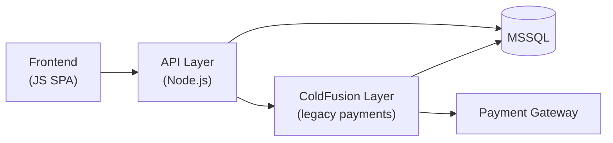
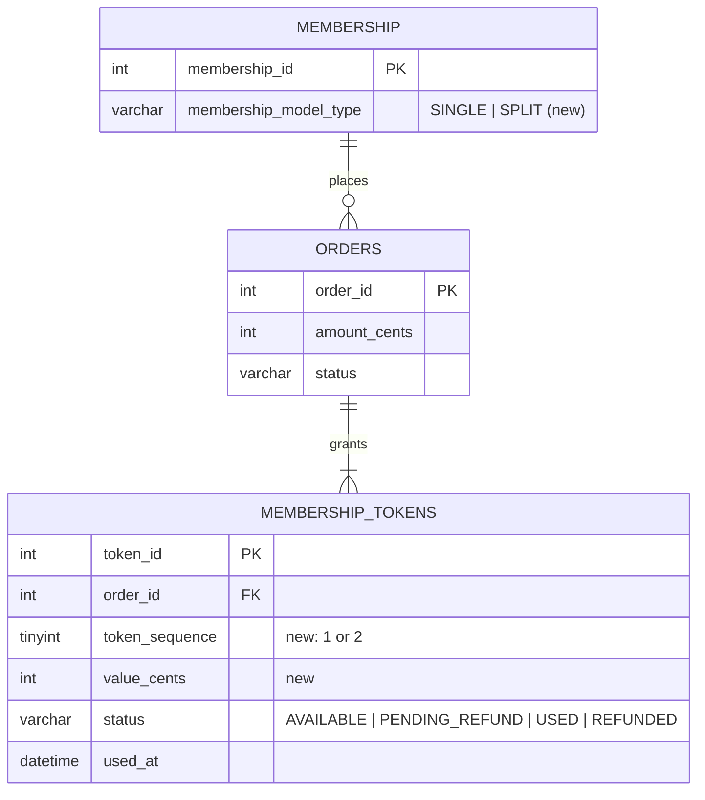
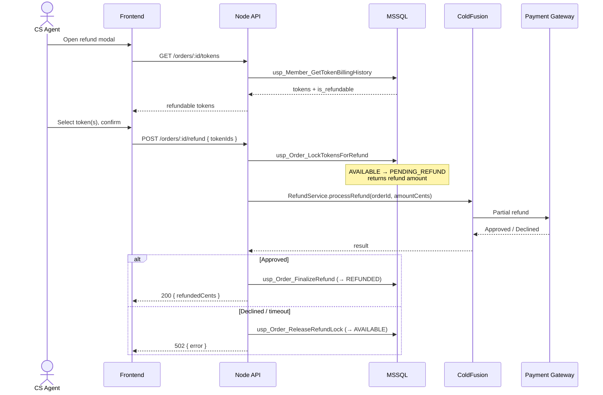
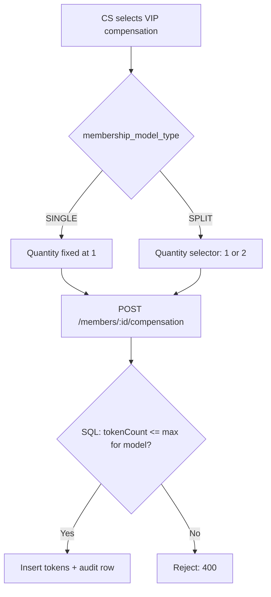

# Technical Planning Doc: Single-Token → Split-Token Membership Model

| | |
|---|---|
| **Status** | Draft — In Review |
| **Author** | Nikko Pisciotti |
| **Reviewers** | Engineering Manager, Staff Engineer + QA team |
| **Last updated** | _[Date]_ |

> _Sample document! All of these are highly contrived examples meant to show how I would document a proposed code change._


---

## 1. Summary

Today, every membership purchase grants the member **one token**, redeemable for one service. We are introducing a **split-token model**: one purchase grants **two half-value tokens**, letting members redeem in smaller increments.

Because the 1-order-to-1-token assumption is baked into several stored procedures, API handlers and UI components, this doc scopes the changes required across three representative workflows:

1. **Refunds** on orders with multiple tokens (touches the ColdFusion payment layer)
2. **Token billing history** — showing which tokens on an order are used vs. refundable
3. **VIP compensation** — allowing CS to award two tokens for split-model members

### Goals
- Support both models side by side, driven by `membership_model_type`
- Partial refunds when one of two tokens has already been used
- No behavior change for existing single-token members

---

## 2. Architecture Context



### Data model changes



**Schema changes**
- `membership.membership_model_type` — `VARCHAR(10) NOT NULL DEFAULT 'SINGLE'`
- `membership_tokens.token_sequence` — position of the token within its order

**Rounding rule:** odd-cent orders split with the remainder on token 1 (e.g. `4999` → `2500` + `2499`). Token values must always sum to the order amount.

---

## 3. Scenario 1 — Refunding an Order with Multiple Tokens

### Current behavior
Refunds are all-or-nothing: the API calls ColdFusion to refund the full captured amount, then voids the order's single token.

### New behavior
- Only **unused** tokens are refundable.
- Refund amount = sum of `value_cents` for the selected unused tokens.
- If every token on the order is used, the refund is rejected.

### Flow



> **Why lock first?** Locking tokens in SQL *before* calling the gateway prevents a member from redeeming a token while its refund is mid-flight, and prevents double refunds from a double-click.


### 3.1 Node API — refund handler

**Before**
```js
async function refundOrder(req, res) {
  const { orderId } = req.params;
  const result = await cfClient.processRefund({ orderId }); // full amount
  await db.exec('usp_Order_Refund', { OrderId: orderId });
  res.json(result);
}
```

**After**
```js
async function refundOrder(req, res) {
  const { orderId } = req.params;
  const { tokenIds } = req.body;

  if (!Array.isArray(tokenIds) || tokenIds.length === 0) {
    return res.status(400).json({ error: 'tokenIds required' });
  }

  let refundCents;
  try {
    ({ refund_cents: refundCents } = await db.exec('usp_Order_LockTokensForRefund', {
      OrderId: orderId,
      TokenIds: toIntListTvp(tokenIds),
    }));
  } catch (err) {
    if (err.number === 50010) return res.status(409).json({ error: err.message });
    throw err;
  }

  try {
    const result = await cfClient.processRefund({ orderId, amountCents: refundCents });
    await db.exec('usp_Order_FinalizeRefund', { OrderId: orderId, TokenIds: toIntListTvp(tokenIds) });
    return res.json({ refundedCents: refundCents, gatewayRef: result.ref });
  } catch (err) {
    await db.exec('usp_Order_ReleaseRefundLock', { OrderId: orderId, TokenIds: toIntListTvp(tokenIds) });
    return res.status(502).json({ error: 'Refund failed at payment gateway' });
  }
}
```

### 3.2 ColdFusion — accept a partial amount

**Before** (`RefundService.cfc`)
```cfml
<cffunction name="processRefund" access="remote" returntype="struct">
    <cfargument name="orderId" type="numeric" required="true">
    <cfset var captured = getCapturedAmount(arguments.orderId)>
    <cfreturn gateway.refund(orderId = arguments.orderId, amount = captured)>
</cffunction>
```

**After**
```cfml
<cffunction name="processRefund" access="remote" returntype="struct">
    <cfargument name="orderId"     type="numeric" required="true">
    <cfargument name="amountCents" type="numeric" required="false">
    <cfset var captured = getCapturedAmount(arguments.orderId)>
    <cfset var amount = structKeyExists(arguments, "amountCents")
                        ? arguments.amountCents / 100 : captured>
    <cfif amount GT captured>
        <cfthrow type="Refund.Invalid" message="Refund exceeds captured amount">
    </cfif>
    <cfreturn gateway.refund(orderId = arguments.orderId, amount = amount)>
</cffunction>
```
`amountCents` is optional so existing callers keep full-refund behavior until they are migrated.

### 3.4 Frontend
- Refund modal lists tokens per order with checkboxes; used tokens are shown disabled with a "Used on _[date]_" label.
- Refund total updates live from the selected tokens' values.
- Single-token orders render exactly as today (one pre-checked row).

---

## 4. Scenario 2 — Token Billing History

### Current behavior
`usp_Member_GetTokenBillingHistory` returns **one row per order**, with a single `token_status` column. Under the split model this hides whether one half has been used.

### New behavior
Return **one row per token**, with an `is_refundable` flag the refund flow (Scenario 1) relies on.

### 4.1 SQL

**Before**
```sql
SELECT  o.order_id,
        o.created_at,
        o.amount_cents,
        t.status   AS token_status,
        t.used_at
FROM    orders o
JOIN    membership_tokens t ON t.order_id = o.order_id   -- implicit 1:1
WHERE   o.member_id = @MemberId
ORDER BY o.created_at DESC;
```

**After**
```sql
SELECT  o.order_id,
        o.created_at,
        o.amount_cents,
        m.membership_model_type,
        t.token_id,
        t.token_sequence,
        COUNT(*) OVER (PARTITION BY o.order_id)        AS tokens_on_order,
        t.value_cents,
        t.status,
        t.used_at,
        CAST(CASE WHEN t.status = 'AVAILABLE' THEN 1 ELSE 0 END AS BIT) AS is_refundable
FROM    orders o
JOIN    membership m          ON m.membership_id = o.membership_id
JOIN    membership_tokens t   ON t.order_id      = o.order_id
WHERE   o.member_id = @MemberId
ORDER BY o.created_at DESC, t.token_sequence;
```

### 4.2 Node API — group rows by order

**Before**
```js
const rows = await db.query('usp_Member_GetTokenBillingHistory', { MemberId: memberId });
res.json(rows);
```

**After**
```js
const rows = await db.query('usp_Member_GetTokenBillingHistory', { MemberId: memberId });

const orders = Object.values(rows.reduce((acc, r) => {
  acc[r.order_id] ??= {
    orderId: r.order_id,
    createdAt: r.created_at,
    amountCents: r.amount_cents,
    modelType: r.membership_model_type,
    tokens: [],
  };
  acc[r.order_id].tokens.push({
    tokenId: r.token_id,
    sequence: r.token_sequence,
    valueCents: r.value_cents,
    status: r.status,
    usedAt: r.used_at,
    isRefundable: r.is_refundable,
  });
  return acc;
}, {}));

res.json({ orders });
```

> **Breaking change:** response shape moves from a flat array to `{ orders: [{ ..., tokens: [] }] }`. Ship behind a versioned route (`/v2/members/:id/billing-history`) until all consumers migrate.

### 4.3 Frontend
- Billing history table becomes an expandable row per order, with token sub-rows ("Token 1 of 2 — Used 03/14", "Token 2 of 2 — Available").
- Order-level badge: **Fully used / Partially used / Unused**.

---

## 5. Scenario 3 — VIP Compensation: Award Two Tokens

### Current behavior
CS can award exactly **one** compensation token. Because split tokens are half-value, a single split token under-compensates relative to the legacy model.

### New behavior
- `SINGLE` members: max **1** compensation token (unchanged).
- `SPLIT` members: up to **2** tokens per action (value-equivalent to one legacy token).

### Flow



### 5.1 SQL

**Before** (`usp_Member_AwardCompensationToken`)
```sql
INSERT INTO membership_tokens (member_id, order_id, status, source)
VALUES (@MemberId, NULL, 'AVAILABLE', 'VIP_COMP');
```

**After**
```sql
-- New param: @TokenCount TINYINT = 1
DECLARE @ModelType VARCHAR(10), @MaxTokens TINYINT, @TokenValue INT;

SELECT @ModelType = membership_model_type
FROM   membership
WHERE  member_id = @MemberId;

SELECT @MaxTokens  = max_comp_tokens,      -- SINGLE: 1, SPLIT: 2
       @TokenValue = comp_token_value_cents
FROM   membership_model_config
WHERE  model_type = @ModelType;

IF @TokenCount < 1 OR @TokenCount > @MaxTokens
    THROW 50020, 'Token count exceeds limit for membership model.', 1;

INSERT INTO membership_tokens (member_id, order_id, token_sequence, value_cents, status, source)
SELECT @MemberId, NULL, n.n, @TokenValue, 'AVAILABLE', 'VIP_COMP'
FROM   (VALUES (1),(2)) AS n(n)
WHERE  n.n <= @TokenCount;

INSERT INTO compensation_audit (member_id, awarded_by, token_count, reason, created_at)
VALUES (@MemberId, @AgentId, @TokenCount, @Reason, SYSUTCDATETIME());
```
Limits live in `membership_model_config` rather than hard-coded `CASE` logic, so a future 3- or 4-token model is a config change, not a sproc change.

### 5.2 Node API

**Before**
```js
await db.exec('usp_Member_AwardCompensationToken', { MemberId: memberId });
```

**After**
```js
const { tokenCount = 1, reason } = req.body;

if (!Number.isInteger(tokenCount) || tokenCount < 1) {
  return res.status(400).json({ error: 'Invalid tokenCount' });
}

try {
  await db.exec('usp_Member_AwardCompensationToken', {
    MemberId: memberId,
    TokenCount: tokenCount,
    AgentId: req.user.id,
    Reason: reason,
  });
  res.status(201).json({ awarded: tokenCount });
} catch (err) {
  if (err.number === 50020) return res.status(400).json({ error: err.message });
  throw err;
}
```
The API does basic validation only; the **sproc is the source of truth** for per-model limits so no client can bypass them.

### 5.3 Frontend
- Compensation form shows a quantity selector (1–2) only when the member's `modelType === 'SPLIT'`; otherwise unchanged.
- Confirmation copy states the total value awarded, not just the token count.

---

## 6. Future Concerns & Risks

| Area | Concern | Mitigation |
|---|---|---|
| **Concurrency** | Token redeemed while its refund is in flight | `PENDING_REFUND` lock + `UPDLOCK`; redemption sproc only consumes `AVAILABLE` |
| **Stuck locks** | Process crash between gateway call and finalize | Scheduled job reconciles `PENDING_REFUND` tokens older than N minutes against gateway records |
| **Rounding** | Odd-cent orders don't split evenly | Remainder assigned to token 1; check constraint/test that token values sum to order amount |
| **Hard-coded "2"** | Future models with N tokens | Drive limits from `membership_model_config`; avoid `= 2` checks in code |
| **Reporting / Finance** | Revenue reports assume 1 token = 1 order | Coordinate with data team; expose `value_cents` per token for recognition |
| **ColdFusion** | Partial-refund logic now spans Node and CF | Keep CF change minimal and backward compatible; track CF payment migration as a separate initiative |
| **API consumers** | Billing history response shape change | Versioned `/v2` route, deprecate `/v1` after consumers migrate |
| **Rollout** | Regressions for existing members | Feature flag per `membership_model_type`; launch SPLIT to internal/test accounts first |

---

## 7. Rollout Plan

1. **Schema migration** — add columns with defaults; backfill existing tokens with `token_sequence = 1`, `value_cents = order.amount_cents`.
2. **Sprocs** — deploy new/updated procedures (backward compatible with SINGLE).
3. **ColdFusion** — deploy optional `amountCents` param.
4. **API** — ship `/v2` billing history, refund and compensation changes behind the feature flag.
5. **Frontend** — ship UI behind the same flag.
6. **Enable** for internal accounts → 10% of new SPLIT purchases → 100%.

## 8. Testing

- **Unit:** refund amount calculation, response grouping, rounding.
- **Integration (SQL):** refund lock with one used + one available token; refund rejected when all tokens used; comp limit enforced per model.
- **End-to-end:** partial refund through CF against the gateway sandbox, including declined and timeout paths.
- **Regression:** full suite against SINGLE members to confirm no behavior change.

## 9. Open Questions

- Should CS be able to override the comp limit with manager approval?
- Do partially refunded orders need a distinct `orders.status` (e.g. `PARTIALLY_REFUNDED`)?
- Should we plan on future brands migrating to a multi-token model?
